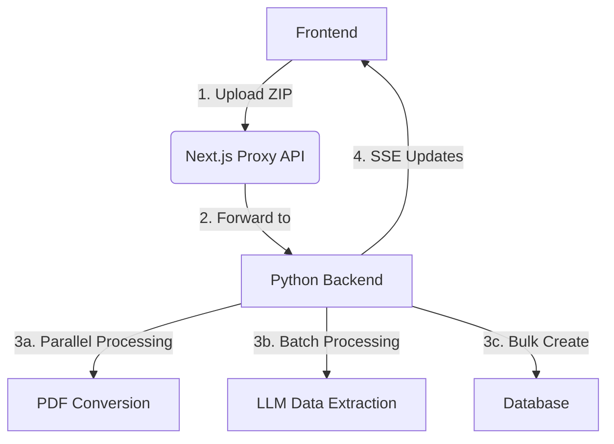

# Batch Job Upload Technical Specification

## Architecture Overview


## Key Changes
1. Move core processing from `app/api/jobs/process-zip/route.ts` to Python backend
2. Maintain existing frontend API interface
3. Enhance Python backend with true parallel processing
4. Implement progress tracking via Redis
5. Add batch processing for LLM operations

## Endpoint Changes

### New Python Endpoints
```python
@router.post("/v2/jobs/process-zip")
async def process_zip_v2(
    file: UploadFile,
    organization_id: str = Form(...),
    is_mock: bool = Form(False),
    status: str = Form("DRAFT")
) -> StreamingResponse:
    """
    Process ZIP file with parallel execution:
    - 10 concurrent PDF conversions
    - 5 concurrent LLM extractions
    - Batch create in chunks of 50
    """
```

### Modified Next.js API Route
```typescript
// Modified proxy implementation
export async function POST(request: NextRequest) {
  // Forward entire form data to Python backend
  const pythonResponse = await fetch(`${process.env.PYTHON_API_URL}/v2/jobs/process-zip`, {
    method: 'POST',
    body: await request.formData()
  });
  
  // Proxy the streaming response
  return new NextResponse(pythonResponse.body, {
    headers: {
      'Content-Type': 'text/event-stream',
      'Cache-Control': 'no-cache'
    }
  });
}
```

## Processing Pipeline

### Phase 1: File Preparation
```python
async def process_zip_v2(...):
    # 1. Save ZIP to temp directory
    # 2. Extract files to memory (no disk write)
    # 3. Validate file structure
    # 4. Create processing batches (10 files/batch)
    # 5. Initialize progress tracking in Redis
```

### Phase 2: Parallel Processing
```python
from concurrent.futures import ProcessPoolExecutor

async def _process_batch(batch: List[Path]):
    with ProcessPoolExecutor(max_workers=10) as executor:
        futures = [executor.submit(process_file, file) for file in batch]
        for future in asyncio.as_completed(futures):
            result = await future
            yield result

async def process_file(file: Path):
    # 1. PDF to text conversion (10 concurrent)
    # 2. LLM data extraction (5 concurrent)
    # 3. Data validation
    # 4. Add to bulk create queue
```

### Phase 3: Batch Operations
```python
# LLM Batch Request Example
async def batch_llm_request(texts: List[str]):
    return await semantic_service.batch_extract_job_data(
        texts=texts,
        batch_size=10,
        retries=3
    )

# Database Bulk Create
async def bulk_create_jobs(jobs: List[JobData]):
    async with DatabaseConnectionPool() as conn:
        await conn.bulk_insert(
            "jobs",
            jobs,
            page_size=50  # Commit every 50 records
        )
```

## Progress Tracking System

### Redis Structure
```json
{
  "job_id:abc123": {
    "total": 100,
    "processed": 0,
    "failed": 0,
    "batches": {
      "batch1": {"status": "processing"},
      "batch2": {"status": "pending"}
    }
  }
}
```

### Event Types
```typescript
interface ProcessingEvent {
  event: 'progress' | 'batch_start' | 'batch_complete' | 'error';
  total: number;
  processed: number;
  failed: number;
  current_batch?: number;
  batch_total?: number;
}
```

## Error Handling Strategy

1. **Transient Errors** (3 retries):
   - LLM API timeouts
   - Database connection issues
   - File read conflicts

2. **Permanent Errors** (immediate failure):
   - Invalid ZIP structure
   - Authentication failures
   - Schema validation errors

```python
async def process_with_retries(task, max_retries=3):
    for attempt in range(max_retries):
        try:
            return await task()
        except TransientError as e:
            if attempt == max_retries - 1:
                raise
            await asyncio.sleep(2 ** attempt)
```

## Performance Optimizations

1. **File Streaming**
```python
async def save_zip(content: bytes):
    with tempfile.NamedTemporaryFile(delete=False) as tmp:
        async for chunk in content:
            tmp.write(chunk)
        return tmp.name
```

2. **Connection Pooling**
```python
class DatabaseConnectionPool:
    def __init__(self):
        self.pool = asyncpg.create_pool(
            min_size=5,
            max_size=20,
            command_timeout=60
        )
```

3. **LLM Batch Optimization**
```python
# Process 10 files per LLM request
async def batch_process_texts(texts: List[str]):
    return await llm_client.batch_request(
        inputs=texts,
        params={"batch_size": 10}
    )
```

## Migration Steps

1. **Phase 1: Backend Preparation**
```python
# Add to Python backend
@app.post("/v2/jobs/process-zip")
async def process_zip_v2(...): ...

# Add batch processing utilities
class BatchProcessor:
    def __init__(self, concurrency=10):
        self.semaphore = asyncio.Semaphore(concurrency)
```

2. **Phase 2: Proxy Implementation**
```typescript
// Modify Next.js route to proxy to Python
export async function POST(request: NextRequest) {
  const response = await fetch(pythonUrl, {
    method: 'POST',
    body: await request.formData()
  });
  return new NextResponse(response.body);
}
```

3. **Phase 3: Frontend Validation**
```typescript
// Verify event stream compatibility
interface ProcessingEvent {
  // Maintain existing fields
  event: 'file_processed' | 'error'; 
  // Add new fields
  batch_number?: number;
  batch_total?: number;
}
```

## Monitoring & Validation

1. **Success Criteria**
```python
# Process 100 files in <15s with:
- 4 CPU cores
- 8GB RAM
- 50Mbps network

# Validation checks
assert processing_time < 15_000  # ms
assert success_rate > 95%
```

2. **Logging Structure**
```json
{
  "timestamp": "2024-02-20T12:34:56Z",
  "job_id": "abc123",
  "stage": "llm_processing",
  "batch": 5,
  "duration_ms": 1200,
  "file_count": 10,
  "error_count": 0,
  "memory_usage": "1.2GB"
}
```

## Rollback Plan

1. **Feature Flag Control**
```python
USE_NEW_PROCESSOR = os.getenv("ENABLE_V2_PROCESSOR", "false") == "true"

@app.post("/process-zip")
async def process_zip(...):
    if USE_NEW_PROCESSOR:
        return await process_zip_v2(...)
    else:
        return await process_zip_v1(...)
```

2. **Versioned Endpoints**
```
/v1/jobs/process-zip - Legacy
/v2/jobs/process-zip - New implementation
```

3. **Monitoring Metrics**
- Processing time per file
- Memory usage per batch
- LLM API success rate
- Database write latency
```

This document provides complete implementation details while maintaining compatibility with the existing frontend interface. The spec includes all necessary components for a junior developer to implement the changes without breaking existing functionality.
