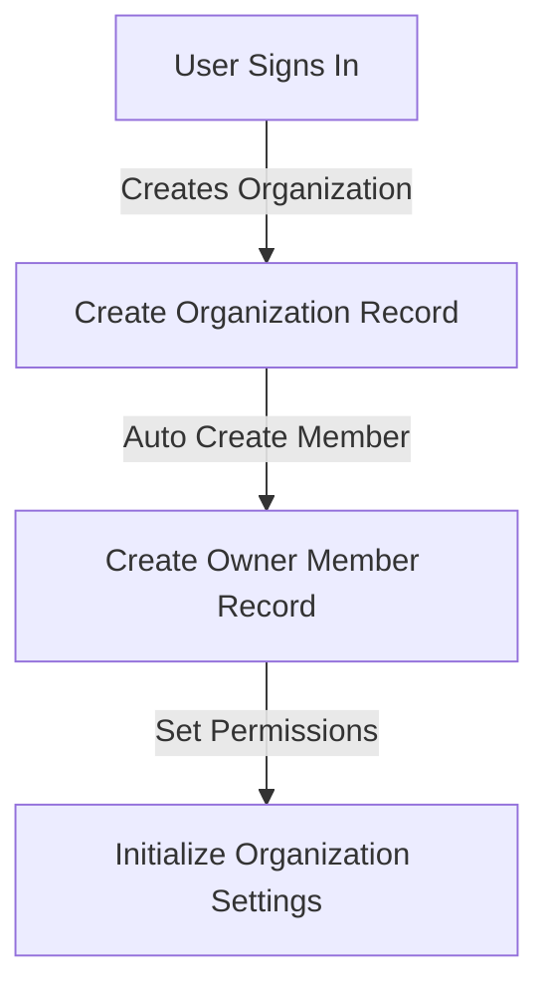
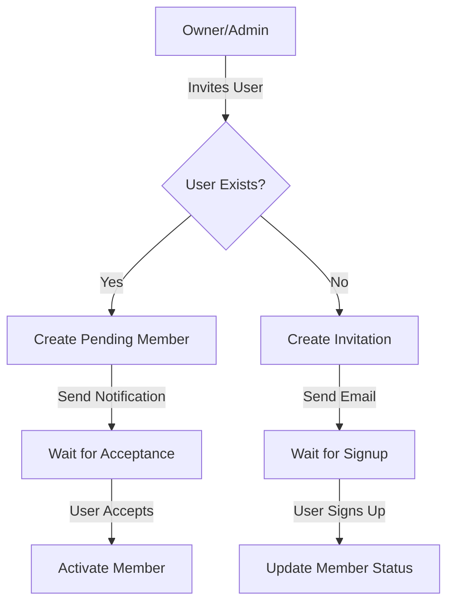
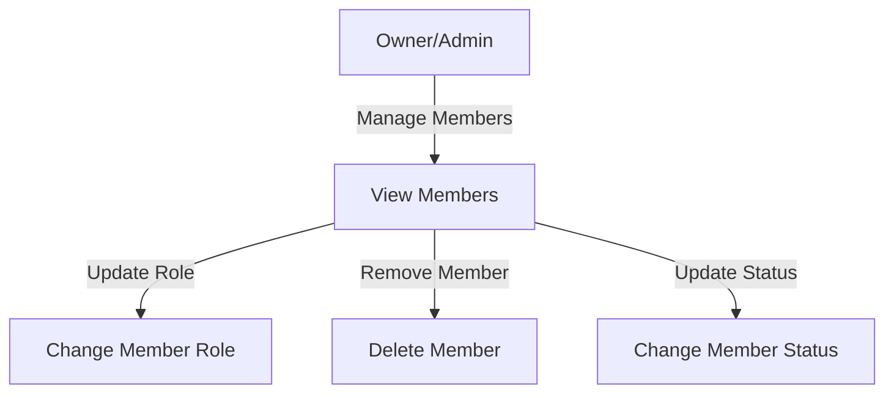

# Organization Management Workflow

## Overview
This document outlines the complete workflow for organization management in HawkHire, including organization creation, member management, and permissions.

## Data Models

### Relationships
```
users (Supabase Auth)
↓
organization_members
↑
organizations
```

### Key Tables
1. `organizations` - Organization details and settings
2. `organization_members` - Membership and roles
3. `users` (Supabase Auth) - User accounts

## Core Workflows

### 1. Organization Creation Flow


**Steps:**
1. User signs up/logs in (Supabase Auth)
2. User creates organization
3. Backend creates organization record
4. Backend automatically creates organization_member record:
   - role: OWNER
   - status: ACTIVE
   - invited_by: null

### 2. Member Invitation Flow


**Steps:**
1. Owner/Admin invites user by email
2. Backend checks if user exists:
   - If exists: Create organization_member record (PENDING)
   - If not: Create invitation record and send email
3. User accepts invitation:
   - Update organization_member status to ACTIVE

### 3. Member Management Flow


## Required Endpoints

### Organization Management
```
POST /v1/organizations
- Create new organization
- Auto-create owner member
- Initialize settings

GET /v1/organizations/{org_id}
- Get organization details
- Include member count
- Include subscription info

PATCH /v1/organizations/{org_id}
- Update organization details
- Handle settings changes

DELETE /v1/organizations/{org_id}
- Delete organization
- Clean up related records
```

### Member Management
```
POST /v1/organizations/{org_id}/invitations
- Send invitations to users
- Handle existing/new user cases

GET /v1/organizations/{org_id}/invitations
- List pending invitations
- Include invitation status

POST /v1/organizations/{org_id}/invitations/{invitation_id}/accept
- Accept invitation
- Create/update member record

GET /v1/organizations/{org_id}/members
- List organization members
- Include roles and status

PATCH /v1/organizations/{org_id}/members/{member_id}
- Update member role/status
- Handle permission changes

DELETE /v1/organizations/{org_id}/members/{member_id}
- Remove member
- Handle cleanup tasks
```

## Security & Permissions

### Roles
1. **OWNER**
   - Can do everything
   - Can transfer ownership
   - Can delete organization

2. **ADMIN**
   - Can manage members
   - Can update organization
   - Cannot delete organization
   - Cannot change owner role

3. **MEMBER**
   - Can view organization
   - Can view other members
   - Can update own profile
   - Limited access to features

4. **GUEST**
   - Very limited access
   - Can view basic info
   - No management rights

### Permission Checks
- Only authenticated users can create organizations
- Only OWNER/ADMIN can invite members
- Only OWNER can change member roles
- Only OWNER can delete the organization
- Members can only see other members of their organization

## Additional Features

### Phase 1 (Core)
- [x] Basic organization CRUD
- [ ] Member management
- [ ] Role-based permissions
- [ ] Email invitations

### Phase 2 (Enhanced)
- [ ] Organization verification
- [ ] Member permissions system
- [ ] Organization settings
- [ ] Audit logging

### Phase 3 (Advanced)
- [ ] Subscription management
- [ ] Advanced analytics
- [ ] Team management
- [ ] SSO integration

## Implementation Progress

### Current Status
- [ ] Organization models defined
- [ ] Basic CRUD endpoints created
- [ ] Member management implemented
- [ ] Security middleware added

### Next Steps
1. Implement organization creation with owner
2. Set up invitation system
3. Add member management endpoints
4. Implement security middleware

## Notes
- Keep track of implementation progress here
- Update status as features are completed
- Document any major decisions or changes 