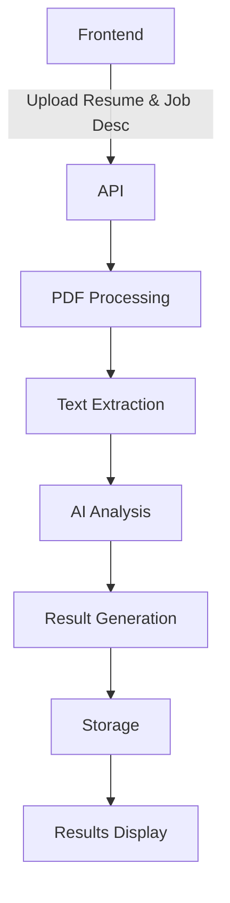

# Smart Resume Evaluator Implementation Plan

## Overview
This document outlines the implementation strategy for the AI-powered resume evaluation feature that matches resumes with job descriptions. The system will leverage existing PDF processing infrastructure while adding new capabilities for direct user interaction.

## Architecture Diagram



## Core Components

### 1. Frontend Modules
```typescript
components/
├── resume-evaluator/
│   ├── ResumeUpload.tsx       // File upload component
│   ├── JobDescriptionInput.tsx// Textarea + job selection
│   ├── AnalysisResults.tsx     // Match visualization
│   └── SkillGapAnalysis.tsx    // Missing skills display
```

### 2. Backend Services
```python
app/
├── api/
│   └── analyze-resume/
│       ├── route.ts           // Next.js API route
│       └── analysis.py        # Core AI processing logic
```

### 3. AI Processing Pipeline
1. PDF/Text Parsing
2. Semantic Understanding
3. Skill Extraction
4. Requirement Matching
5. Gap Analysis

## Implementation Phases

### Phase 1: Core Analysis Engine

#### Backend Modifications
```python
@app.post("/v1/analyze-resume")
async def analyze_resume(
    resume: UploadFile,
    job_description: str = Form(...),
    existing_job_id: str = Form(None)
):
    # Validate inputs
    if resume.content_type not in ['application/pdf', 'text/plain']:
        raise HTTPException(400, "Unsupported file type")
    
    # Process resume
    text_content = await semantic_service.convert_pdf_to_text(resume)
    
    # Analyze against job description
    analysis = await semantic_service.analyze_document(
        text_content, 
        job_description,
        RESUME_INDEX_CONFIG
    )
    
    return {
        "match_score": analysis['score'],
        "matched_skills": analysis['matching_skills'],
        "missing_keywords": analysis['missing_keywords'],
        "recommendations": analysis['suggested_improvements']
    }
```

#### Frontend Components
```typescript
import { ResumeUpload, AnalysisResults } from '@/components/resume-evaluator'

export default function ResumeEvaluatorPage() {
  const [analysis, setAnalysis] = useState(null)
  const [loading, setLoading] = useState(false)

  const handleSubmit = async (formData: FormData) => {
    setLoading(true)
    try {
      const response = await fetch('/api/analyze-resume', {
        method: 'POST',
        body: formData
      })
      setAnalysis(await response.json())
    } finally {
      setLoading(false)
    }
  }

  return (
    <div className="max-w-4xl mx-auto p-6">
      <h1 className="text-3xl font-bold mb-8">AI Resume Evaluator</h1>
      
      <form onSubmit={handleSubmit}>
        <div className="space-y-6">
          <JobDescriptionInput />
          <ResumeUpload />
          
          <button 
            type="submit"
            disabled={loading}
            className="bg-primary text-white px-6 py-3 rounded-lg disabled:opacity-50"
          >
            {loading ? 'Analyzing...' : 'Evaluate Resume'}
          </button>
        </div>
      </form>

      {analysis && <AnalysisResults data={analysis} />}
    </div>
  )
}
```

### Phase 2: Enhanced Features

1. **Existing Job Integration**
```typescript
interface Job {
  id: string
  title: string
  description: string
}

export function JobSelector() {
  const [jobs, setJobs] = useState<Job[]>([])
  
  useEffect(() => {
    fetch('/api/jobs')
      .then(res => res.json())
      .then(setJobs)
  }, [])

  return (
    <Select onValueChange={(value) => setSelectedJob(value)}>
      <SelectTrigger>
        <SelectValue placeholder="Select existing job..." />
      </SelectTrigger>
      <SelectContent>
        {jobs.map(job => (
          <SelectItem key={job.id} value={job.id}>
            {job.title}
          </SelectItem>
        ))}
      </SelectContent>
    </Select>
  )
}
```

2. **PDF Parsing Enhancements**
```python
async def parse_resume_content(text: str) -> dict:
    """Enhanced resume parsing with multiple fallback strategies"""
    try:
        # First try structured extraction
        return await semantic_service.extract_knowledge(text)
    except Exception as e:
        logger.warning(f"Structured extraction failed: {str(e)}")
        # Fallback to GPT-4 analysis
        return await semantic_service.analyze_document(text, "")
```

### Phase 3: Security & Validation

1. **File Security Middleware**
```python
MAX_FILE_SIZE = 5 * 1024 * 1024  # 5MB
ALLOWED_MIME_TYPES = {'application/pdf', 'text/plain'}

async def validate_upload(file: UploadFile):
    if file.size > MAX_FILE_SIZE:
        raise HTTPException(413, "File size exceeds 5MB limit")
    if file.content_type not in ALLOWED_MIME_TYPES:
        raise HTTPException(415, "Unsupported file type")
    
    # Basic malware scanning
    content = await file.read()
    if b'%PDF' not in content[:4] and file.content_type == 'application/pdf':
        raise HTTPException(400, "Invalid PDF file")
```

2. **Rate Limiting**
```python
from fastapi_limiter import Limiter
limiter = Limiter(key_func=get_remote_address)

@app.post("/v1/analyze-resume")
@limiter.limit("10/minute")
async def analyze_resume(..., request: Request):
```

## Analysis Workflow

1. **Text Normalization**
   - Convert all text to lowercase
   - Remove special characters
   - Expand abbreviations (CEO → Chief Executive Officer)

2. **Skill Matching Algorithm**
```python
def match_skills(resume_skills: list, job_skills: list) -> dict:
    matched = []
    missing = []
    
    # Create normalized versions
    resume_norm = [skill.lower().strip() for skill in resume_skills]
    job_norm = [skill.lower().strip() for skill in job_skills]
    
    for skill in job_norm:
        if any(skill in res_skill for res_skill in resume_norm):
            matched.append(skill)
        else:
            missing.append(skill)
    
    return {
        'match_percentage': len(matched) / len(job_norm),
        'matched': matched,
        'missing': missing
    }
```

## AI Prompt Engineering

```json
{
    "skill_extraction": {
        "system": "You are an expert resume analyst. Extract technical skills from this resume:",
        "user": "Return skills as JSON array with categories:\n- programming_languages\n- frameworks\n- tools\n- certifications"
    },
    "gap_analysis": {
        "system": "Analyze gaps between resume and job requirements:",
        "user": "Identify missing skills from job description and suggest learning resources. Use markdown formatting for readability."
    }
}
```

## Testing Strategy

### 1. Unit Tests
```python
def test_skill_matching():
    resume = ['Python', 'React', 'AWS']
    job = ['python', 'node.js', 'cloud']
    result = match_skills(resume, job)
    assert result['match_percentage'] == 0.66
    assert 'python' in result['matched']
    assert 'node.js' in result['missing']
```

### 2. Integration Tests
```typescript
describe('Resume Analysis Flow', () => {
  it('should process PDF and return analysis', async () => {
    const file = new File(['test'], 'resume.pdf', { type: 'application/pdf' })
    const response = await analyzeResume(file, 'Sample job description')
    
    expect(response).toHaveProperty('match_score')
    expect(response.matched_skills).toBeInstanceOf(Array)
  })
})
```

### 3. Performance Testing
```bash
# Load test with 100 concurrent requests
artillery quick --count 100 -n 50 http://localhost:8000/v1/analyze-resume
```

## Deployment Checklist

1. **Environment Variables**
```env
# Required for AI analysis
AI_MODEL=gpt-4
ANALYSIS_TIMEOUT=30
MAX_SKILLS=50
```

2. **Dependencies**
```bash
# PDF processing requirements
pip install pdfplumber python-docx
```

3. **Monitoring**
- API response times
- Error rates
- Model usage costs
- File processing success rate

## Future Enhancements

1. **Multi-Resume Comparison**
2. **Interview Question Generator**
3. **Salary Estimation**
4. **Company Culture Fit Analysis**
5. **Versioned Analysis History**

## Timeline & Milestones

| Phase       | Duration | Deliverables                      |
|-------------|----------|-----------------------------------|
| Core MVP    | 2 weeks  | Basic PDF analysis & UI          |
| Job Matching| 1 week   | Existing job integration         |
| Security    | 3 days   | Rate limits & file validation    |
| Optimization| 1 week   | Caching & performance tuning     |

This plan leverages existing infrastructure while adding new AI-powered capabilities. The implementation focuses on accuracy, performance, and security while maintaining flexibility for future enhancements.
