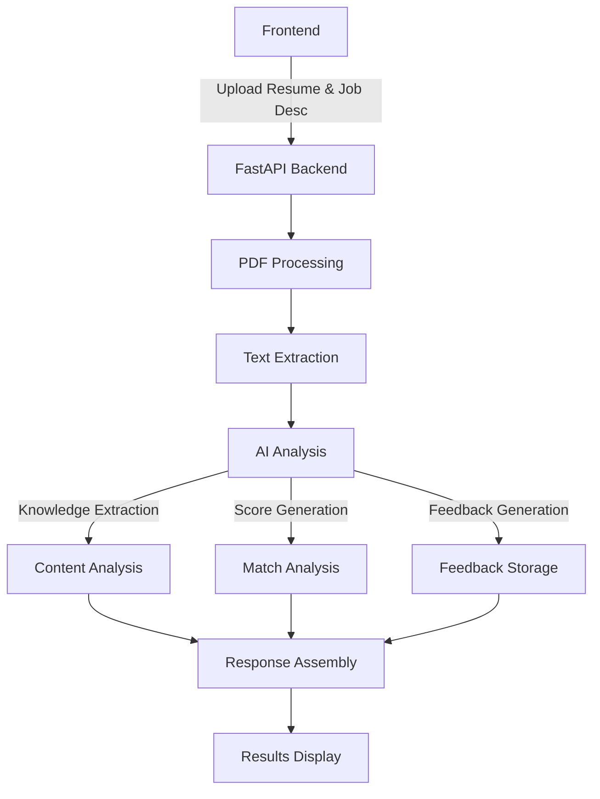

# Smart Resume Evaluator Implementation Plan

## Overview
This document outlines the implementation of the AI-powered resume evaluation feature. The system uses FastAPI for the backend, with a React/Next.js frontend, leveraging AI services for intelligent resume analysis.

## Architecture Diagram



## Core Components

### 1. Frontend Modules
```typescript
components/
├── resume-evaluator/
│   ├── ResumeUpload.tsx        // File upload component
│   ├── JobDescriptionInput.tsx // Textarea + job selection
│   ├── AnalysisResults/
│   │   ├── MatchScore.tsx      // Score visualization
│   │   ├── SkillsBreakdown.tsx // Skills with scores
│   │   ├── FeedbackView.tsx    // Markdown feedback display
│   │   └── ActionItems.tsx     // Improvement suggestions
│   └── common/
│       ├── LoadingState.tsx    // Analysis in progress
│       └── ErrorState.tsx      // Error handling
```

### 2. Backend Structure
```python
backend/
├── app/
│   ├── main.py                # FastAPI application
│   ├── config/
│   │   └── resume_index.json  # Analysis configuration
│   └── services/
│       └── semantic.py        # AI service integration
```

### 3. AI Processing Pipeline
1. PDF Text Extraction
2. Language Detection
3. Knowledge Extraction
4. Match Analysis
5. Feedback Generation
6. Response Assembly

## Implementation Status

### Completed Backend Features

#### 1. Core Analysis Endpoint
```python
@app.post("/v1/analyze-resume")
async def analyze_resume(
    resume: UploadFile,
    job_description: str = Form(...),
    existing_job_id: str = Form(None),
    exclude_fields: str = Form(None)
):
    # Implemented features:
    # - PDF text extraction
    # - Language detection
    # - Knowledge extraction
    # - Match analysis
    # - Comprehensive feedback
    # - File info tracking
    # - Optional embedding generation
```

#### 2. Feedback System
```python
@app.get("/v1/feedback/{feedback_slug}")
async def get_feedback(feedback_slug: str):
    """Retrieve stored feedback content"""
```

#### 3. Response Schema
```json
{
    "upload_id": "string",
    "job_id": "string",
    "timestamp": "string",
    "content": {
        "data": {
            "title": "string",
            "profile": {},
            "skills": [],
            "years_of_experience": "number"
        }
    },
    "file_info": {
        "name": "string",
        "size": "number",
        "mime_type": "string",
        "language": "string"
    },
    "matching_score": {
        "data": {
            "score": {
                "value": "number"
            },
            "justification": {}
        }
    },
    "feedback": {
        "content": "string",
        "slug": "string",
        "url": "string"
    }
}
```

### Planned UI Implementation

#### 1. Upload Flow
- Drag-and-drop resume upload
- Job description input/selection
- Progress indication
- Error handling

#### 2. Results Display
- Match score visualization
- Skills breakdown with proficiency levels
- Interactive feedback sections
- Improvement suggestions
- Download/share options

#### 3. Responsive Design
- Mobile-first approach
- Tablet optimization
- Desktop layout

## Security & Validation

### 1. File Validation
```python
ALLOWED_MIME_TYPES = {'application/pdf', 'text/plain'}
MAX_FILE_SIZE = 5 * 1024 * 1024  # 5MB

async def validate_upload(file: UploadFile):
    # Size validation
    # MIME type validation
    # Content validation
```

### 2. Parameter Validation
```python
class ExcludeFields(BaseModel):
    fields: List[str]
    
    @validator('fields')
    def validate_fields(cls, v):
        allowed = {'embedding', 'content', 'file_info'}
        if not all(f in allowed for f in v):
            raise ValueError(f"Invalid fields. Allowed: {allowed}")
        return v
```

### 3. Feedback Storage
```python
def validate_feedback_path(path: str):
    """Ensure feedback file paths are safe"""
    if '..' in path or not path.endswith('.md'):
        raise ValueError("Invalid feedback path")
```

## Testing Strategy

### 1. Backend Tests
```python
def test_analyze_resume():
    # Test full analysis pipeline
    # Test exclude_fields functionality
    # Test language detection

def test_feedback_generation():
    # Test feedback content
    # Test markdown formatting
    # Test pronouns replacement

def test_score_extraction():
    # Test matching_score extraction
    # Test skills average fallback
    # Test score formatting
```

### 2. Frontend Tests
```typescript
describe('ResumeEvaluator', () => {
    it('handles file upload correctly', () => {})
    it('displays analysis results properly', () => {})
    it('shows appropriate loading states', () => {})
    it('handles errors gracefully', () => {})
})
```

### 3. Integration Tests
```python
async def test_full_analysis_flow():
    # Test file upload
    # Test analysis
    # Test feedback storage
    # Test feedback retrieval
```

## Deployment Checklist

1. **Environment Setup**
```env
AI_MODEL=gpt-4
SEMANTIC_SERVICE_URL=http://127.0.0.1:8000
MAX_FILE_SIZE=5242880
```

2. **Dependencies**
```bash
# Backend
pip install fastapi uvicorn python-multipart httpx python-slugify

# Frontend
npm install @radix-ui/react-icons @radix-ui/react-progress marked
```

3. **Monitoring**
- API response times
- Error rates
- Feedback storage usage
- File processing success rate

## Timeline

| Phase | Task | Status |
|-------|------|--------|
| Backend Core | Basic Analysis | ✅ Completed |
| Backend Core | Feedback System | ✅ Completed |
| Frontend | Upload UI | 🏗️ In Progress |
| Frontend | Results Display | 📅 Planned |
| Frontend | Responsive Design | 📅 Planned |
| Testing | Backend Tests | 📅 Planned |
| Testing | Frontend Tests | 📅 Planned |
| Deploy | Production Setup | 📅 Planned |

This implementation plan reflects our current progress and outlines the remaining work, particularly focusing on the UI implementation phase starting tomorrow.
