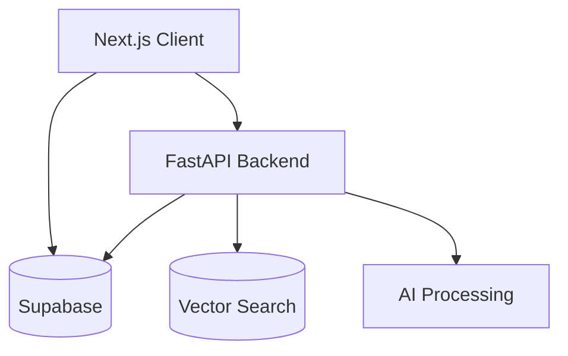
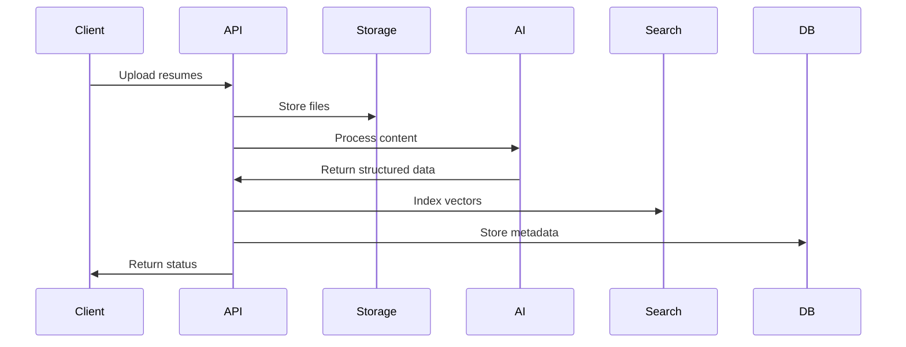
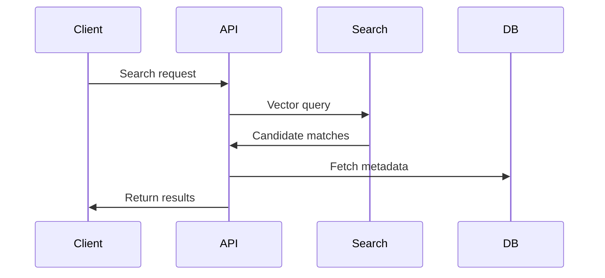

# HawkHire Technical Design Document

## Overview
This document outlines the technical design and implementation details for HawkHire, based on the requirements and stack defined in `app-goals-and-stack.md`.

## System Architecture

### High-Level Architecture


### Component Breakdown

#### 1. Frontend Layer (Next.js)
- **Client-Side State**
  ```typescript
  // Job search store example using Zustand
  interface JobSearchStore {
    filters: {
      query: string
      location: string
      remote: boolean
      salary: [number, number]
    }
    results: Job[]
    setFilters: (filters: Partial<Filters>) => void
    fetchResults: () => Promise<void>
  }
  ```

- **Server State Management**
  ```typescript
  // TanStack Query example for job fetching
  const useJobs = (filters: JobFilters) => {
    return useQuery({
      queryKey: ['jobs', filters],
      queryFn: () => fetchJobs(filters),
      staleTime: 1000 * 60 * 5, // 5 minutes
    })
  }
  ```

#### 2. Backend Services

##### FastAPI Service
- **Core Responsibilities**
  - Resume processing orchestration
  - Vector search integration
  - AI model integration
  - Job matching logic

- **Key Endpoints**
  ```python
  @app.post("/process-resumes")
  async def process_resumes(
      files: List[UploadFile],
      job_id: UUID,
      background_tasks: BackgroundTasks
  ):
      # Resume processing logic
      pass

  @app.get("/search-candidates")
  async def search_candidates(
      job_id: UUID,
      filters: dict,
      page: int = 1,
      limit: int = 20
  ):
      # Candidate search logic
      pass
  ```

##### Supabase Integration
- **Data Models** (as defined in app-goals-and-stack.md)
- **Real-time Subscriptions**
  ```typescript
  // Example real-time job updates
  supabase
    .channel('public:jobs')
    .on(
      'postgres_changes',
      { event: '*', schema: 'public', table: 'jobs' },
      (payload) => {
        // Handle real-time updates
      }
    )
    .subscribe()
  ```

##### Vector Search Service
- **Index Management**
  - One index per job posting
  - Automatic reindexing on updates
  - Periodic optimization

- **Search Operations**
  ```python
  async def semantic_search(
      index_name: str,
      query_vector: List[float],
      filters: dict,
      size: int = 20
  ) -> List[Dict]:
      # Vector search implementation
      pass
  ```

### Data Flow & Synchronization

#### 1. Resume Processing Flow


#### 2. Search & Match Flow


### Implementation Strategy

#### Phase 1: Core Infrastructure
1. Set up Supabase project and database schema
2. Initialize Next.js project with TypeScript
3. Set up FastAPI backend
4. Configure development environment

#### Phase 2: Basic Features
1. User authentication
2. Job posting CRUD
3. Basic resume upload
4. Simple search functionality

#### Phase 3: AI Integration
1. Resume processing pipeline
2. Vector search implementation
3. Matching algorithm
4. Real-time updates

#### Phase 4: Advanced Features
1. Batch processing
2. Advanced search filters
3. Analytics dashboard
4. Mobile optimization

### Security Considerations

#### 1. Authentication
- Supabase Auth with JWT
- Role-based access control
- Session management

#### 2. Data Protection
- Encryption at rest
- Secure file storage
- Data access logging

#### 3. API Security
- Rate limiting
- Input validation
- CORS configuration

### Resource Management & Limits

#### 1. Tiered System
```typescript
interface TierLimits {
  free: {
    maxConcurrentUploads: 5,
    maxBatchSize: 20,
    storageLimit: '5GB',
    monthlyProcessingLimit: 100,
    retentionPeriod: '30 days'
  },
  professional: {
    maxConcurrentUploads: 15,
    maxBatchSize: 50,
    storageLimit: '20GB',
    monthlyProcessingLimit: 500,
    retentionPeriod: '90 days'
  },
  enterprise: {
    maxConcurrentUploads: 50,
    maxBatchSize: 200,
    storageLimit: '100GB',
    monthlyProcessingLimit: 'unlimited',
    retentionPeriod: '365 days'
  }
}
```

#### 2. Rate Limiting
```python
RATE_LIMITS = {
    'search_operations': {
        'free': '60/hour',
        'professional': '300/hour',
        'enterprise': '1000/hour'
    },
    'resume_processing': {
        'free': '100/day',
        'professional': '500/day',
        'enterprise': '2000/day'
    },
    'api_requests': {
        'free': '1000/day',
        'professional': '10000/day',
        'enterprise': '50000/day'
    }
}
```

### Error Handling & Recovery

#### 1. File Processing Errors
```typescript
enum ProcessingErrorType {
  FORMAT_INVALID,
  SIZE_EXCEEDED,
  CONTENT_CORRUPT,
  SERVICE_UNAVAILABLE,
  AI_PROCESSING_FAILED,
  STORAGE_FULL
}

interface ProcessingError {
  type: ProcessingErrorType
  retryable: boolean
  userActionRequired: boolean
  suggestedAction?: string
  fallbackStrategy?: string
}

const ERROR_HANDLING_STRATEGY: Record<ProcessingErrorType, ProcessingError> = {
  FORMAT_INVALID: {
    retryable: false,
    userActionRequired: true,
    suggestedAction: 'Convert to supported format (PDF/DOC/DOCX)',
  },
  SIZE_EXCEEDED: {
    retryable: false,
    userActionRequired: true,
    suggestedAction: 'Compress file or split into smaller documents',
  },
  CONTENT_CORRUPT: {
    retryable: false,
    userActionRequired: true,
    suggestedAction: 'Re-upload valid document',
  },
  SERVICE_UNAVAILABLE: {
    retryable: true,
    userActionRequired: false,
    fallbackStrategy: 'Queue for retry with exponential backoff',
  },
  AI_PROCESSING_FAILED: {
    retryable: true,
    userActionRequired: false,
    fallbackStrategy: 'Attempt with backup model or queue for retry',
  },
  STORAGE_FULL: {
    retryable: false,
    userActionRequired: true,
    suggestedAction: 'Upgrade storage or clear space',
  }
}
```

#### 2. Retry Strategies
```python
RETRY_CONFIGS = {
    'ai_processing': {
        'max_attempts': 3,
        'backoff_factor': 2,  # exponential
        'initial_delay': 5,   # seconds
        'max_delay': 300,     # 5 minutes
        'fallback_models': ['gpt-3.5-turbo', 'text-davinci-003']
    },
    'vector_search': {
        'max_attempts': 5,
        'backoff_factor': 1.5,
        'initial_delay': 1,
        'max_delay': 60
    },
    'file_processing': {
        'max_attempts': 2,
        'backoff_factor': 2,
        'initial_delay': 3,
        'max_delay': 30
    }
}
```

### Data Management

#### 1. Storage Monitoring
```typescript
interface StorageThresholds {
  warning: 80,    // Notify when 80% full
  critical: 90,   // Block new uploads
  emergency: 95   // Trigger automated cleanup
}

interface RetentionPolicy {
  inactive_resumes: '180 days',
  failed_processes: '30 days',
  audit_logs: '365 days',
  temp_files: '24 hours'
}
```

#### 2. Audit Trail
```sql
CREATE TABLE audit_logs (
    id UUID PRIMARY KEY,
    organization_id UUID REFERENCES organizations(id),
    user_id UUID REFERENCES auth.users(id),
    action_type TEXT NOT NULL,
    resource_type TEXT NOT NULL,
    resource_id UUID NOT NULL,
    metadata JSONB,
    ip_address TEXT,
    user_agent TEXT,
    created_at TIMESTAMPTZ DEFAULT NOW()
);

CREATE INDEX idx_audit_org_time ON audit_logs(organization_id, created_at);
```

### Performance Specifications

#### 1. Search Performance
```typescript
interface PerformanceTargets {
  search: {
    p95_latency: '200ms',
    p99_latency: '500ms',
    max_concurrent: 50,
    cache_ttl: '5 minutes'
  },
  resume_processing: {
    batch_size: 15,
    p95_processing_time: '2 seconds',
    max_concurrent_batches: 10
  },
  api_endpoints: {
    p95_latency: '300ms',
    timeout: '30 seconds',
    max_payload: '100MB'
  }
}
```

#### 2. Caching Strategy
```typescript
interface CacheConfig {
  job_listings: {
    ttl: '5 minutes',
    stale_while_revalidate: '1 minute'
  },
  search_results: {
    ttl: '2 minutes',
    stale_while_revalidate: '30 seconds'
  },
  user_profiles: {
    ttl: '15 minutes',
    stale_while_revalidate: '5 minutes'
  }
}
```

### Deployment & Environment Configuration

#### 1. Environment Setup
```yaml
# docker-compose.yml
services:
  app:
    build: .
    environment:
      NODE_ENV: ${NODE_ENV}
      SUPABASE_URL: ${SUPABASE_URL}
      SUPABASE_ANON_KEY: ${SUPABASE_ANON_KEY}
      VECTOR_SEARCH_URL: ${VECTOR_SEARCH_URL}
      AI_SERVICE_URL: ${AI_SERVICE_URL}
      REDIS_URL: ${REDIS_URL}
      
  worker:
    build: ./worker
    environment:
      QUEUE_URL: ${QUEUE_URL}
      MAX_CONCURRENT_JOBS: ${MAX_CONCURRENT_JOBS}
      
  redis:
    image: redis:7-alpine
    ports:
      - "6379:6379"
```

#### 2. Database Migrations
```typescript
interface MigrationStrategy {
  type: 'rolling' | 'blue-green'
  validation_period: '15 minutes'
  rollback_trigger: {
    error_rate: '5%',
    p95_latency: '1 second'
  }
}

const MIGRATION_STEPS = [
  'Backup current database',
  'Apply migrations to replica',
  'Verify replica functionality',
  'Switch read traffic to replica',
  'Monitor for issues (15 minutes)',
  'Switch write traffic to replica',
  'Monitor for issues (15 minutes)',
  'Promote replica to primary'
]
```

#### 3. Deployment Pipeline
```yaml
# GitHub Actions workflow
name: Deployment
on:
  push:
    branches: [main]
    
jobs:
  deploy:
    runs-on: ubuntu-latest
    steps:
      - uses: actions/checkout@v3
      
      - name: Run Tests
        run: npm test
        
      - name: Build
        run: npm run build
        
      - name: Deploy to Staging
        if: success()
        run: |
          deploy-to-staging
          
      - name: Run E2E Tests
        run: npm run test:e2e
        
      - name: Monitor Staging
        run: |
          monitor-staging-metrics
          
      - name: Deploy to Production
        if: success()
        run: |
          deploy-to-production
          
      - name: Rollback on Failure
        if: failure()
        run: |
          rollback-to-last-stable
```

## Next Steps

1. **Infrastructure Setup**
   - Initialize Supabase project
   - Set up development environment
   - Configure CI/CD

2. **Core Development**
   - Implement authentication
   - Create basic UI components
   - Set up API endpoints

3. **Feature Implementation**
   - Follow phase-wise implementation
   - Regular testing and validation
   - Performance monitoring

This technical design will be iteratively updated as implementation progresses. 